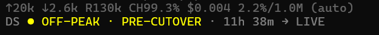

# @juanmackie/pi-deepseek-peak

A small [pi](https://pi.dev) package that shows DeepSeek's scheduled
**PEAK/OFF-PEAK** pricing phase and countdown in pi's default status bar.
It also performs a lightweight authenticated DeepSeek account-health check
using pi's existing DeepSeek credentials.

**Author:** JUAN MACKIE

[](https://www.npmjs.com/package/@juanmackie/pi-deepseek-peak)
[](https://github.com/juanmackie/pi-deepseek-peak)
[](https://pi.dev/packages/%40juanmackie/pi-deepseek-peak)

Published package links: [npm](https://www.npmjs.com/package/@juanmackie/pi-deepseek-peak) · [GitHub](https://github.com/juanmackie/pi-deepseek-peak) · [pi.dev](https://pi.dev/packages/%40juanmackie/pi-deepseek-peak)

## Quick start

Requirements: pi installed and Node.js `>=22.19.0`.

1. Install the published package:

   ```sh
   pi install npm:@juanmackie/pi-deepseek-peak
   ```

   To install the current source checkout instead:

   ```sh
   pi install ./
   ```

2. Start or reload pi:

   ```text
   /reload
   ```

   If pi was not running during installation, start a new `pi` session instead.

3. Configure DeepSeek using pi's normal login flow:

   ```text
   /login
   ```

   Select **DeepSeek**, or start pi with the existing `DEEPSEEK_API_KEY`
   environment variable. The extension reuses that credential; it never asks
   for or stores a second key.

4. Look at pi's default footer. You should see a status like:

   ```text
   DS ● OFF-PEAK · 02h 13m → PEAK
   ```

   Before the scheduled pricing cutover, `PRE-CUTOVER` and `→ LIVE` appear.
   A `⚠` means the account-health check needs attention; the schedule remains
   usable.

For a one-session smoke test, use `pi -e ./extensions/deepseek-peak/index.ts`.
See [`docs/operations.md`](./docs/operations.md) for troubleshooting,
updates, removal, security boundaries, and maintainer verification.

## Install

The current published release is `0.1.1` on npm. Public packages with the
`pi-package` keyword are indexed in the pi.dev catalog automatically:

```sh
pi install npm:@juanmackie/pi-deepseek-peak
```

To pin that release:

```sh
pi install npm:@juanmackie/pi-deepseek-peak@0.1.1
```

From this local checkout:

```sh
pi install ./
```

For a one-off direct test:

```sh
pi -e ./extensions/deepseek-peak/index.ts
```

The package is raw TypeScript; pi loads the extension through its normal
TypeScript extension loader. The named status composes with pi's built-in
footer rather than replacing the footer.

Package links:

- npm: <https://www.npmjs.com/package/@juanmackie/pi-deepseek-peak>
- GitHub: <https://github.com/juanmackie/pi-deepseek-peak>
- pi.dev: <https://pi.dev/packages/%40juanmackie/pi-deepseek-peak>

## Credentials and API health

The extension reuses pi's provider credentials. Configure DeepSeek once with
pi's normal `/login` flow, or use the same `DEEPSEEK_API_KEY` environment
variable that pi's built-in DeepSeek provider uses. The extension does not
provide a second key-entry mechanism.

At startup and at most once every five minutes, it calls:

```text
GET https://api.deepseek.com/user/balance
Authorization: Bearer <the resolved pi DeepSeek key>
```

The destination, headers, and key come from the same resolved pi provider-auth
record. A configured HTTPS provider base URL is used as-is; credentials are
never sent to a different origin, and redirects are rejected. The response is
checked for the documented `is_available` and `balance_infos` shape, but
balance amounts are never displayed, logged, persisted, or sent to the model.
A successful balance response proves account/auth reachability, not inference
latency or model availability.

Set `PI_OFFLINE=1` (or `true`/`yes`) to skip the extension-owned API request.
Offline mode keeps the schedule visible and does not add a warning.

## Status bar output



After the pricing cutover, examples are:

```text
DS ● OFF-PEAK · 02h 13m → PEAK
DS ● PEAK · 00h 42m → OFF-PEAK
```

Before the cutover, the status shows the would-be schedule phase with an
explicit marker and counts down to the live schedule:

```text
DS ● OFF-PEAK · PRE-CUTOVER · 16h 03m → LIVE
```

The pre-cutover phase is a schedule projection only. DeepSeek's currently
published flat prices remain the billing rule until `2026-08-16 16:00 UTC`;
the marker prevents this projection from being mistaken for an active
surcharge.

A compact `⚠` is appended when account health is degraded, including:

- no configured DeepSeek key;
- invalid provider destination or conflicting auth configuration;
- invalid key or another HTTP failure;
- network, timeout, or malformed response;
- an authenticated response with `is_available: false` (insufficient balance).

The phase and countdown remain available in every warning state. The
extension does not show repeated notifications.

## Schedule

The schedule is calculated locally in UTC because DeepSeek does not document
an endpoint that reports the current pricing phase:

- PEAK: `01:00–04:00 UTC` and `06:00–10:00 UTC`;
- OFF-PEAK: all other times;
- peak prices are 2× the off-peak prices;
- the schedule becomes effective at `2026-08-16 16:00 UTC`.

The phase windows and cutover are intentionally baked into the package and
must be updated if DeepSeek changes its pricing page. The extension trusts the
host clock, so a badly configured system clock can produce a wrong phase.

## Development and verification

```sh
npm install
npm run typecheck
npm test
npm run pack:check
```

The tests cover exact cutover/window boundaries, day rollover, countdown
formatting, auth and response handling, unsafe destinations, timeouts, offline
mode, lifecycle cleanup, stale requests, and secret non-disclosure.

The package was validated with TypeScript, the Vitest suite, npm pack
inspection, direct `pi -e` loading, and a local `pi install ./` smoke check.
The published npm release is `0.1.1`; pi.dev indexes public npm packages
automatically.
The authenticated health request itself requires a user-provided DeepSeek
credential and is intentionally not run as part of automated tests.

## Sources and attribution

- [DeepSeek Models & Pricing](https://api-docs.deepseek.com/quick_start/pricing/)
- [DeepSeek Get User Balance](https://api-docs.deepseek.com/api/get-user-balance/)
- [DeepSeek API authentication](https://api-docs.deepseek.com/api/deepseek-api)
- [DeepSeek error codes](https://api-docs.deepseek.com/quick_start/error_codes)
- [`YMRYMR/deepseek-peak`](https://github.com/YMRYMR/deepseek-peak), reviewed at
  commit `44873104d8afe5a81814205ad6701684c396f709`

The schedule math is adapted from that MIT-licensed project. See
[`THIRD_PARTY_NOTICES.md`](./THIRD_PARTY_NOTICES.md) and [`LICENSE`](./LICENSE).
